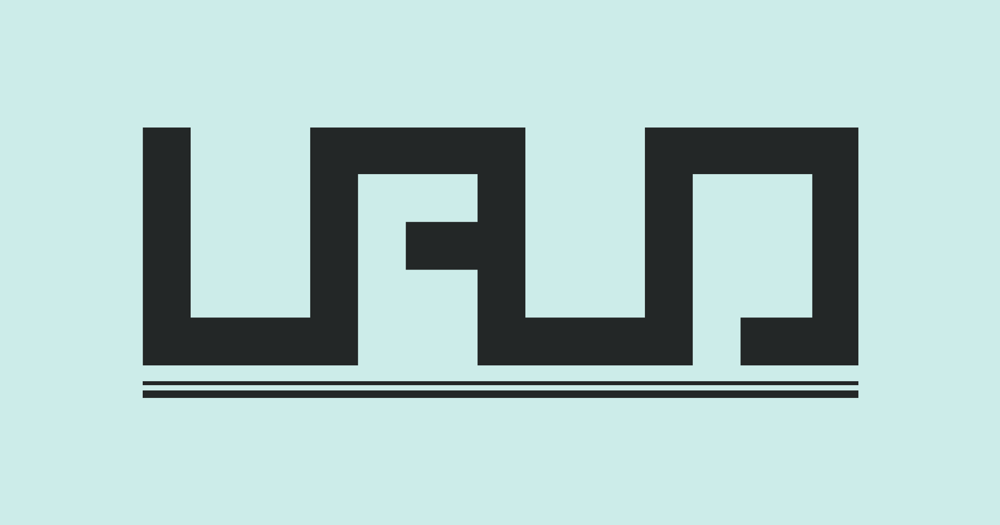

# Lalogo.dev 
My personal website, integrated with [Manfred](https://www.getmanfred.com) via GitHub webhooks managed with Azure Functions in [lalogo.dev-relay](https://github.com/la-lo-go/lalogo.dev-relay).



## How does it work?
This website works thanks for [lalogo.dev-relay](https://github.com/la-lo-go/lalogo.dev-relay), a conjunction of Azure Functions that allows to update the website's content by changing the content inside [Manfred](https://www.getmanfred.com/) for the resume and projects and, soon, Notion for the blog.


## Environment variables
This project uses a `.env` file to filter the main projects from the rest of the projects. The variables should look like this: 
```env
MAIN_PROJECTS = "mangateca-mango;qbittelegram;the-phpoly;shingeki-no-infinite"
```
- `MAIN_PROJECTS` is a string with the names of the main projects separated by a semicolon and slugified.


## Acknowledgements
- The inspiration behind the website structure, [michael-andreuzza/swissfolio](https://github.com/michael-andreuzza/swissfolio), 
- The link hover effect idea, courtesy of [The Web Witch's Blog](https://blog.stephaniestimac.com/)
- The work experience component, a contribution from [midudev/porfolio.dev](https://github.com/midudev/porfolio.dev)
- The modal component, provided by [markteekman/accessible-astro-components](https://github.com/markteekman/accessible-astro-components/blob/main/Modal.astro)