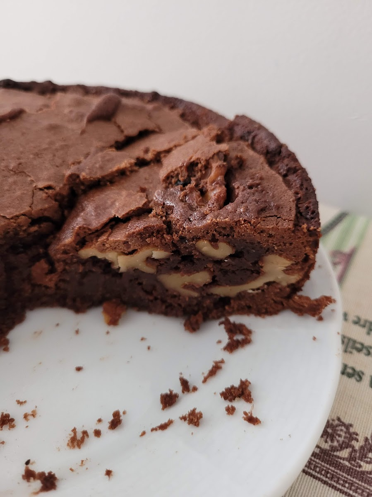

Basada en la [receta de Gonzalo D’Ambrosio](https://www.gonzalodambrosio.com/single-post/2017/04/11/video-el-verdadero-brownie) 
## Ingredientes
- 130 gr de chocolate troceado (70% cacao es lo ideal)
- 180 gr de mantequilla sin sal partida en trozos
- 180 gr de azúcar
- 150 gr de azúcar moreno
- 3 huevos XL a temperatura ambiente
- 1 cucharadita de esencia vainilla
- Media cucharadita de café molido
- 200 gr de harina normal
- 100 gr de nueces
## Preparación
1. Precalentar el horno a 200ºC
2. Derretimos el chocolate con la mantequilla en el microondas poco a poco o a fuego bajo al baño María.
3. Tostamos a fuego bajo las nueces en una sartén con un poco de mantequilla y una pizca de sal (cuidado que son muy traicioneras)
4. Mezclamos los huevos con el azúcar moreno y blanco. 
5. Añadimos la vainilla y mezclamos con el chocolate fundido.
6. Mezclamos la harina y el cacao y lo mezclamos con la preparación de chocolate.
7. Añadimos las nueces previamente tostadas.
8. Vertemos sobre un molde no muy estrecho ENGRASADO O CON PAPEL DE HORNO
9. Horneamos 25 minutos 
10. Tapamos con papel de horno y dejamos enfriar completamente para que se ponga un poco más firme
11. Disfrutar!
## Ejemplos
	
<empty-block/>
