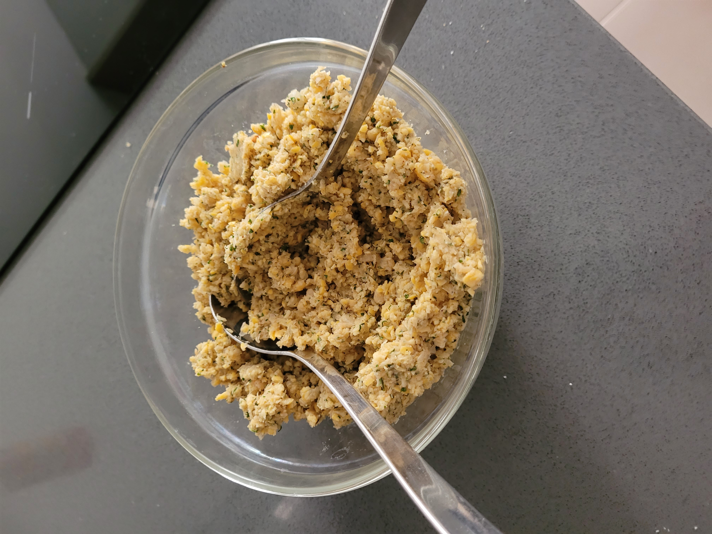
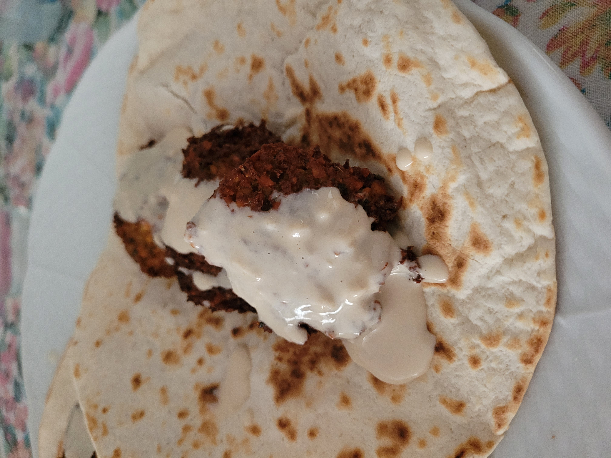

## Ingredientes
- 125g de garbanzos crudos
- Un puñado de perejil y otro de cilantro (preferiblemente fresco)
- ½ cebolla
- 3 Cucharadas de harina
- ¼ cucharada de polvo de hornear
- 4 cucharadas de pan rallado
- 2 dientes de ajo
- 1 cucharada de comino
- Pimienta negra
- Sal
## Preparación
1. Dejar en remojo los garbanzos por lo menos 12 horas antes 
2. Escurrir bien los garbanzos y triturarlos hasta que queden  con textura como en la foto
	
3. Retirar a un bol y picar la cebolla con los ajos, el perejil y el cilantro
4. Echar de nuevo los garbanzos a la picadora con la harina, polvo de hornear, el pan rallado y todo el resto de especias y mezclar bien
5. Retirar al bol
6. Hacer la forma con dos cucharas o con una especial para falafel apretando bien
7. Freír en aceite (preferiblemente girasol) a temperatura media-alta hasta que se dore (unos dos minutos). Se puede hacer por tandas
8. Calentar la tortilla de maiz
9. Servir con verduras y salsa tarator (tahini con limón y ajo)
## Congelación
Mejor congelar la masa del falafel ya con forma pero no frita!!
## Ejemplos
	
