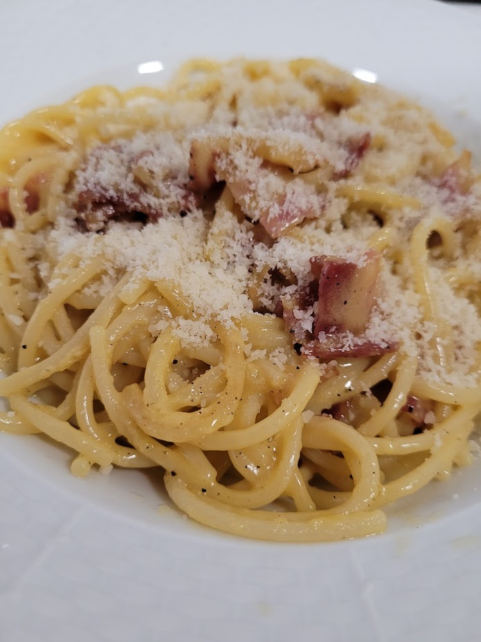
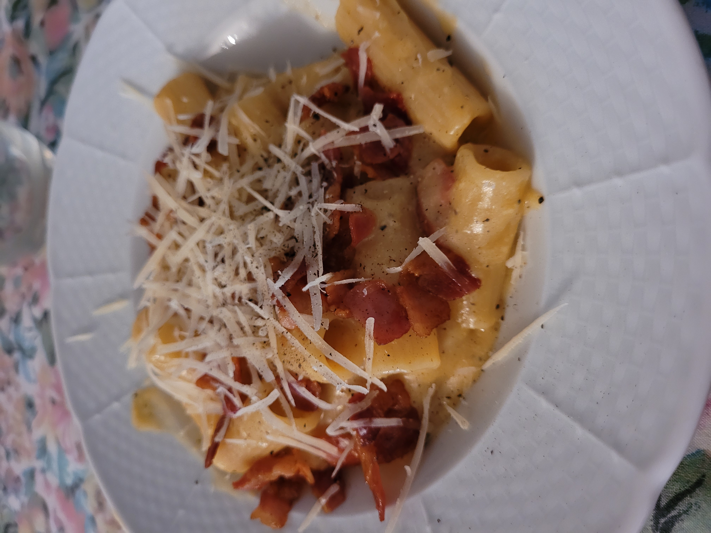
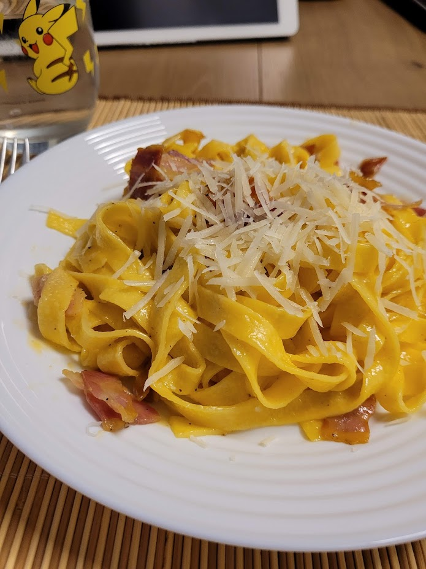

### ❗Disclaimer❗
Esta **no** es una pasta tradicional italiana™ pero si que intenta asemejarse mucho con productos fáciles de conseguir así que por eso se usa panceta con un poco de aceite y no guaciale.
## Ingredientes (1 persona)
- Pasta seca (90-100g)
- 2 yemas
- Pecorino Romano sería lo ideal pero en su defecto se puede usar Granna Paddano (50g)
- 3 tiras de panceta
- Pimienta negra (mucho mejor recién molida)
## Elaboración
1. Partir las tiras de panceta y ponerlas en una sartén fría con un poquito de mantequilla. Mantener la sartén tapada para conservar todo el calor con el fuego medio bajo (3-4 de 9). Amontonar todo en un lado y mover de vez en cuando.
2. Si el tiempo de cocción de la pasta es de unos 8 minutos meterla YA en el agua cociendo con sal el tiempo que ponga el paquete (o un poquito menos), si es de menos podemos esperar un poco, lo ideal es sincronizar el final de la pasta con la panceta .
3. Mientras tanto en un bol añadimos las dos yemas y mezclamos con el queso y la pimienta.
4. Cuando la pasta ya esté reservamos un poco de agua de cocción.
5. Retirar la panceta de la sartén cuando ya empiece a tener color dejando la grasa.
6. EXTRA: si la panceta ha soltado mucha grasa se puede usar la mitad para echarlo en el huevo y emulsionar.
7. Echar la pasta directamente desde la olla, sin escurrir, y dejar que absorba la grasa y se caliente.
8. Verter la pasta de la sartén en el bol con la salsa y mezclar bien.
9. Emplatar con más queso, pimienta recién molida y la panceta.
10. ¡Gozarlo!
## Ejemplos

