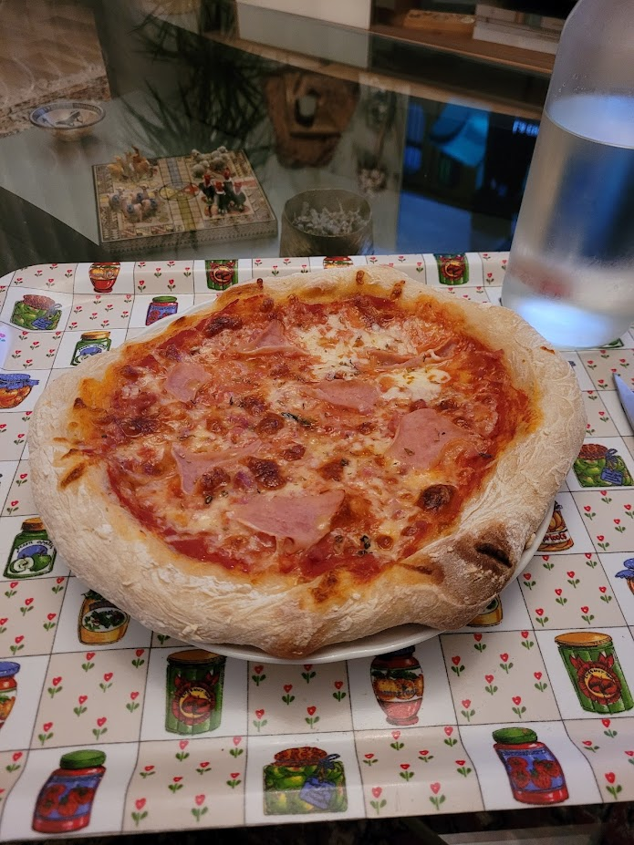

Basado en la receta ["NEAPOLITAN STYLE PIZZA"](https://www.youtube.com/watch?v=xqVgJHThsco) de Brian Lagerstrom
## Ingredientes
- 450g de agua templada.
- 18g (casi dos cucharitas) de sal.
- 7g (un sobre entero) de levadura de panadería en polvo, 4g si es levadura fresca.
- 550g de harina.
## Elaboración de la masa
1. Disolver la sal en el agua.
2. Añadir la levadura, no hace falta mezclar.
3. Ir añadiendo y mezclando la harina en tandas (250-150-150).
4. Remover todo muy bien hasta que esté homogéneo y desarrolle un poco de gluten.
5. Esperar 1 hora y dar 10 o más pliegues. Repetir esto 3 veces.
6. Partir en 4-5 partes.
7. Aceitar tuppers (tampoco mucho, solo para una capa fina).
8. Dejar fermentar mínimo 6 horas hasta una semana.
## Preparación final y horneado
1. Precalentar con una bandeja en la mitad el horno con calor arriba y abajo hasta lo que de pero si se usa papel de horno no pasar de 260°*C.*
2. Mientras tanto dar forma a la pizza ([Este tutorial](https://youtu.be/xqVgJHThsco?t=434) sirve para lo básico, pero tampoco hace falta fliparse). Si se hace con papel de horno debajo la transferencia al horno será mas fácil.
3. Transferir a la bandeja que hay dentro del horno sin sacarla 
	- Si se ha usado papel de horno una tabla de cortar puede ayudar, simplemente ponla al nivel de la encimera y desliza encima de la tabla
4. Hornea unos 10 minutos hasta que lo de arriba y los bordes estén al gusto.
5. Comprueba la parte de abajo y si está poco hecha pon la bandeja en el suelo del horno y apaga el calor de arriba.
6. Cuando ya esté perfecta sácala y a disfrutar!
## Congelación de la masa
1. Aceitar film transparente.
2. Volcar la masa.
3. Cogiendo de los extremos ayudar a la masa a que se recoja en forma de bola en el centro.
4. Congelar encima de una superficie plana.
5. Para descongelar sacar 3 horas antes y preferiblemente ponerla dentro de un contendor con forma circular para que no se desparrame.
## Ejemplos

