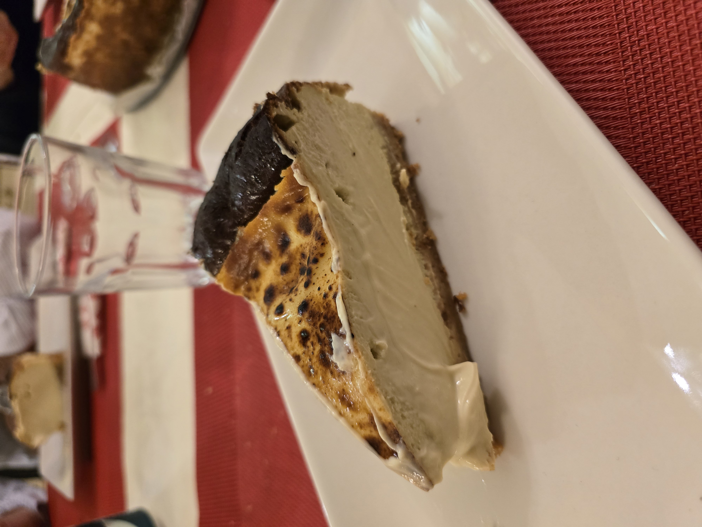

## Ingredientes
- 200g de galletas
- 110g de mantequilla derretida
- 6 huevos medianos
- 250g de azúcar
- 900g de queso de untar
- 500ml de nata para montar
- 4 cucharadas soperas de crema de pistacho (40%)
- 2 pizcas de sal
- 1 cucharada rasa de maicena
- Molde circular de 25cm de diámetro 
## Preparación
1. Tritura las galletas y mezcla con la mantequilla derretida
2. Unta los bordes del molde con mantequilla 
3. Extiende la galleta al fondo del molde y aplasta
4. Mete el resto de ingredientes en un cuenco grande y mezcla (puedes usar una batidora
5. Vierte la mezcla en el molde con la base de galletas 
6. Al horno a 210°C, calor arriba y abajo, a media altura durante 40 minutos. No pasa nada porque esté aún líquido 
7. Si al llegar al tiempo aún el centro está muy blanco dar un golpe de gratinador o con un soplete
8. Dejar reposar hasta que temple
9. Meter en nevera unas 12 horas mínimo 
10. Gozar
## ¿Se puede hacer de más sabores?
Sí! Puedes cambiar el pistacho por crema de avellanas, turrón, vainilla, whisky….. lo que quieras!!!
## Ejemplos
	
	<empty-block/>
